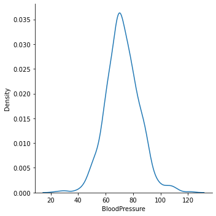
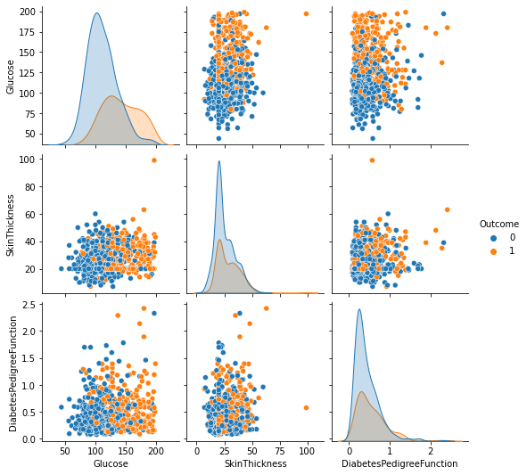
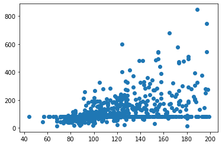
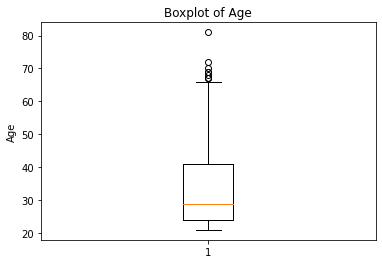
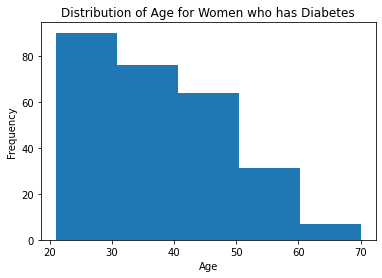
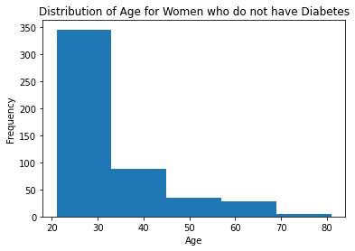
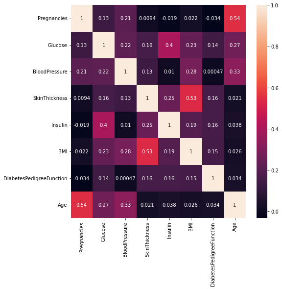

# Foundations of Data Science Project - Diabetes Analysis

---------------
## Context
---------------

Diabetes is one of the most frequent diseases worldwide and the number of diabetic patients are growing over the years. The main cause of diabetes remains unknown, yet scientists believe that both genetic factors and environmental lifestyle play a major role in diabetes.

A few years ago research was done on a tribe in America which is called the Pima tribe (also known as the Pima Indians). In this tribe, it was found that the ladies are prone to diabetes very early. Several constraints were placed on the selection of these instances from a larger database. In particular, all patients were females at least 21 years old of Pima Indian heritage. 

-----------------
## Objective
-----------------

Here, we are analyzing different aspects of Diabetes in the Pima Indians tribe by doing Exploratory Data Analysis.

-------------------------
## Data Dictionary
-------------------------

The dataset has the following information:

* Pregnancies: Number of times pregnant
* Glucose: Plasma glucose concentration over 2 hours in an oral glucose tolerance test
* BloodPressure: Diastolic blood pressure (mm Hg)
* SkinThickness: Triceps skin fold thickness (mm)
* Insulin: 2-Hour serum insulin (mu U/ml)
* BMI: Body mass index (weight in kg/(height in m)^2)
* DiabetesPedigreeFunction: A function that scores the likelihood of diabetes based on family history.
* Age: Age in years
* Outcome: Class variable (0: a person is not diabetic or 1: a person is diabetic)

## Import the necessary libraries and briefly explain the use of each library 


```python
import numpy as np
import pandas as pd
import seaborn as sns
import matplotlib.pyplot as plt
%matplotlib inline
```
NumPy is a python programming library that allows us to manipulate arrays and use arithmetic functions on arrays. Pandas is another python programming library that allows us to create and series and dataframes or tables. The Pandas library contains many tools for manipulating and analyzing data. Seaborn, MatPlotLib, and PyPlot are also Python librarys. These libraries contain tools for graph plotting and visualization of data.

##  Read the given dataset 


```python
pima = pd.read_csv("diabetes.csv")
```

## Show the last 10 records of the dataset


```python
pima.tail(10)
```


<div>
<style scoped>
    .dataframe tbody tr th:only-of-type {
        vertical-align: middle;
    }

    .dataframe tbody tr th {
        vertical-align: top;
    }

    .dataframe thead th {
        text-align: right;
    }
</style>
<table border="1" class="dataframe">
  <thead>
    <tr style="text-align: right;">
      <th></th>
      <th>Pregnancies</th>
      <th>Glucose</th>
      <th>BloodPressure</th>
      <th>SkinThickness</th>
      <th>Insulin</th>
      <th>BMI</th>
      <th>DiabetesPedigreeFunction</th>
      <th>Age</th>
      <th>Outcome</th>
    </tr>
  </thead>
  <tbody>
    <tr>
      <th>758</th>
      <td>1</td>
      <td>106</td>
      <td>76</td>
      <td>20</td>
      <td>79</td>
      <td>37.5</td>
      <td>0.197</td>
      <td>26</td>
      <td>0</td>
    </tr>
    <tr>
      <th>759</th>
      <td>6</td>
      <td>190</td>
      <td>92</td>
      <td>20</td>
      <td>79</td>
      <td>35.5</td>
      <td>0.278</td>
      <td>66</td>
      <td>1</td>
    </tr>
    <tr>
      <th>760</th>
      <td>2</td>
      <td>88</td>
      <td>58</td>
      <td>26</td>
      <td>16</td>
      <td>28.4</td>
      <td>0.766</td>
      <td>22</td>
      <td>0</td>
    </tr>
    <tr>
      <th>761</th>
      <td>9</td>
      <td>170</td>
      <td>74</td>
      <td>31</td>
      <td>79</td>
      <td>44.0</td>
      <td>0.403</td>
      <td>43</td>
      <td>1</td>
    </tr>
    <tr>
      <th>762</th>
      <td>9</td>
      <td>89</td>
      <td>62</td>
      <td>20</td>
      <td>79</td>
      <td>22.5</td>
      <td>0.142</td>
      <td>33</td>
      <td>0</td>
    </tr>
    <tr>
      <th>763</th>
      <td>10</td>
      <td>101</td>
      <td>76</td>
      <td>48</td>
      <td>180</td>
      <td>32.9</td>
      <td>0.171</td>
      <td>63</td>
      <td>0</td>
    </tr>
    <tr>
      <th>764</th>
      <td>2</td>
      <td>122</td>
      <td>70</td>
      <td>27</td>
      <td>79</td>
      <td>36.8</td>
      <td>0.340</td>
      <td>27</td>
      <td>0</td>
    </tr>
    <tr>
      <th>765</th>
      <td>5</td>
      <td>121</td>
      <td>72</td>
      <td>23</td>
      <td>112</td>
      <td>26.2</td>
      <td>0.245</td>
      <td>30</td>
      <td>0</td>
    </tr>
    <tr>
      <th>766</th>
      <td>1</td>
      <td>126</td>
      <td>60</td>
      <td>20</td>
      <td>79</td>
      <td>30.1</td>
      <td>0.349</td>
      <td>47</td>
      <td>1</td>
    </tr>
    <tr>
      <th>767</th>
      <td>1</td>
      <td>93</td>
      <td>70</td>
      <td>31</td>
      <td>79</td>
      <td>30.4</td>
      <td>0.315</td>
      <td>23</td>
      <td>0</td>
    </tr>
  </tbody>
</table>
</div>


#### Observation:

There are 9 columns and 768 rows.
## Show the first 10 records of the dataset 


```python
pima.head(10)
```


<div>
<style scoped>
    .dataframe tbody tr th:only-of-type {
        vertical-align: middle;
    }

    .dataframe tbody tr th {
        vertical-align: top;
    }

    .dataframe thead th {
        text-align: right;
    }
</style>
<table border="1" class="dataframe">
  <thead>
    <tr style="text-align: right;">
      <th></th>
      <th>Pregnancies</th>
      <th>Glucose</th>
      <th>BloodPressure</th>
      <th>SkinThickness</th>
      <th>Insulin</th>
      <th>BMI</th>
      <th>DiabetesPedigreeFunction</th>
      <th>Age</th>
      <th>Outcome</th>
    </tr>
  </thead>
  <tbody>
    <tr>
      <th>0</th>
      <td>6</td>
      <td>148</td>
      <td>72</td>
      <td>35</td>
      <td>79</td>
      <td>33.600000</td>
      <td>0.627</td>
      <td>50</td>
      <td>1</td>
    </tr>
    <tr>
      <th>1</th>
      <td>1</td>
      <td>85</td>
      <td>66</td>
      <td>29</td>
      <td>79</td>
      <td>26.600000</td>
      <td>0.351</td>
      <td>31</td>
      <td>0</td>
    </tr>
    <tr>
      <th>2</th>
      <td>8</td>
      <td>183</td>
      <td>64</td>
      <td>20</td>
      <td>79</td>
      <td>23.300000</td>
      <td>0.672</td>
      <td>32</td>
      <td>1</td>
    </tr>
    <tr>
      <th>3</th>
      <td>1</td>
      <td>89</td>
      <td>66</td>
      <td>23</td>
      <td>94</td>
      <td>28.100000</td>
      <td>0.167</td>
      <td>21</td>
      <td>0</td>
    </tr>
    <tr>
      <th>4</th>
      <td>0</td>
      <td>137</td>
      <td>40</td>
      <td>35</td>
      <td>168</td>
      <td>43.100000</td>
      <td>2.288</td>
      <td>33</td>
      <td>1</td>
    </tr>
    <tr>
      <th>5</th>
      <td>5</td>
      <td>116</td>
      <td>74</td>
      <td>20</td>
      <td>79</td>
      <td>25.600000</td>
      <td>0.201</td>
      <td>30</td>
      <td>0</td>
    </tr>
    <tr>
      <th>6</th>
      <td>3</td>
      <td>78</td>
      <td>50</td>
      <td>32</td>
      <td>88</td>
      <td>31.000000</td>
      <td>0.248</td>
      <td>26</td>
      <td>1</td>
    </tr>
    <tr>
      <th>7</th>
      <td>10</td>
      <td>115</td>
      <td>69</td>
      <td>20</td>
      <td>79</td>
      <td>35.300000</td>
      <td>0.134</td>
      <td>29</td>
      <td>0</td>
    </tr>
    <tr>
      <th>8</th>
      <td>2</td>
      <td>197</td>
      <td>70</td>
      <td>45</td>
      <td>543</td>
      <td>30.500000</td>
      <td>0.158</td>
      <td>53</td>
      <td>1</td>
    </tr>
    <tr>
      <th>9</th>
      <td>8</td>
      <td>125</td>
      <td>96</td>
      <td>20</td>
      <td>79</td>
      <td>31.992578</td>
      <td>0.232</td>
      <td>54</td>
      <td>1</td>
    </tr>
  </tbody>
</table>
</div>


## The dimension of the `pima` dataframe. 


```python
pima.shape
```


    (768, 9)


From the shape command you can get the number of rows and columns of the dataset. There are 768 rows and 9 columns. 
## The size of the `pima` dataframe. 


```python
pima.size
```


    6912


#### Observations: 

The size property returns the number of rows times columns. So the exact number of data cells in the dataframe is 6912.
## The data types of all the variables in the data set


```python
pima.info()
```

    <class 'pandas.core.frame.DataFrame'>
    RangeIndex: 768 entries, 0 to 767
    Data columns (total 9 columns):
     #   Column                    Non-Null Count  Dtype  
    ---  ------                    --------------  -----  
     0   Pregnancies               768 non-null    int64  
     1   Glucose                   768 non-null    int64  
     2   BloodPressure             768 non-null    int64  
     3   SkinThickness             768 non-null    int64  
     4   Insulin                   768 non-null    int64  
     5   BMI                       768 non-null    float64
     6   DiabetesPedigreeFunction  768 non-null    float64
     7   Age                       768 non-null    int64  
     8   Outcome                   768 non-null    int64  
    dtypes: float64(2), int64(7)
    memory usage: 54.1 KB


#### Observations:
There are seven variables that are of type integer (int64). There are two variables (BMI and DiabetesPedigreeFunction) which are of type float or decimal values (float64). There are no null columns. The data consists of integers and float values.
## Missing Values


```python
pima.isnull().values.any()
```


    False


#### Observations: 
By missing values we mean null values; this means there is no data or value for that row's column. There are no missing values in the pima dataframe.
## The summary statistics of the data represent


```python
pima.iloc[: , 0 : 8].describe()
```


<div>
<style scoped>
    .dataframe tbody tr th:only-of-type {
        vertical-align: middle;
    }

    .dataframe tbody tr th {
        vertical-align: top;
    }

    .dataframe thead th {
        text-align: right;
    }
</style>
<table border="1" class="dataframe">
  <thead>
    <tr style="text-align: right;">
      <th></th>
      <th>Pregnancies</th>
      <th>Glucose</th>
      <th>BloodPressure</th>
      <th>SkinThickness</th>
      <th>Insulin</th>
      <th>BMI</th>
      <th>DiabetesPedigreeFunction</th>
      <th>Age</th>
    </tr>
  </thead>
  <tbody>
    <tr>
      <th>count</th>
      <td>768.000000</td>
      <td>768.000000</td>
      <td>768.000000</td>
      <td>768.000000</td>
      <td>768.000000</td>
      <td>768.000000</td>
      <td>768.000000</td>
      <td>768.000000</td>
    </tr>
    <tr>
      <th>mean</th>
      <td>3.845052</td>
      <td>121.675781</td>
      <td>72.250000</td>
      <td>26.447917</td>
      <td>118.270833</td>
      <td>32.450805</td>
      <td>0.471876</td>
      <td>33.240885</td>
    </tr>
    <tr>
      <th>std</th>
      <td>3.369578</td>
      <td>30.436252</td>
      <td>12.117203</td>
      <td>9.733872</td>
      <td>93.243829</td>
      <td>6.875374</td>
      <td>0.331329</td>
      <td>11.760232</td>
    </tr>
    <tr>
      <th>min</th>
      <td>0.000000</td>
      <td>44.000000</td>
      <td>24.000000</td>
      <td>7.000000</td>
      <td>14.000000</td>
      <td>18.200000</td>
      <td>0.078000</td>
      <td>21.000000</td>
    </tr>
    <tr>
      <th>25%</th>
      <td>1.000000</td>
      <td>99.750000</td>
      <td>64.000000</td>
      <td>20.000000</td>
      <td>79.000000</td>
      <td>27.500000</td>
      <td>0.243750</td>
      <td>24.000000</td>
    </tr>
    <tr>
      <th>50%</th>
      <td>3.000000</td>
      <td>117.000000</td>
      <td>72.000000</td>
      <td>23.000000</td>
      <td>79.000000</td>
      <td>32.000000</td>
      <td>0.372500</td>
      <td>29.000000</td>
    </tr>
    <tr>
      <th>75%</th>
      <td>6.000000</td>
      <td>140.250000</td>
      <td>80.000000</td>
      <td>32.000000</td>
      <td>127.250000</td>
      <td>36.600000</td>
      <td>0.626250</td>
      <td>41.000000</td>
    </tr>
    <tr>
      <th>max</th>
      <td>17.000000</td>
      <td>199.000000</td>
      <td>122.000000</td>
      <td>99.000000</td>
      <td>846.000000</td>
      <td>67.100000</td>
      <td>2.420000</td>
      <td>81.000000</td>
    </tr>
  </tbody>
</table>
</div>


#### Observations: 
The summary statistics represent a overall view of your dataset. It displays the total count, mean (average), the standard deviation, the minimum and maximum values, and the quartiles of each column or variable. These values describe the center, spread, and shape of the data. 

The count of Pima women in the sample is 768. The mean age is approx. 33. The minimum value is 21 and max is 81. So, the age range is 60 years. 29 years old is the median value, this is closer to Q1 which indicates some skewness in the age distribution. The IQR is 17, this is the range of the middle 50% of ages. The women above 60 are outliers. There is a large difference between the average insulin value of 118 and the max of 846.
## The plot the distribution plot for the variable 'BloodPressure'.


```python
sns.displot(pima['BloodPressure'], kind = 'kde')
plt.show()
```


    

    


#### Observations: 

From the above distribution plot we can interpret that the total blood pressure is between the range 60 to 80 for a large number of observations and that the blood pressure is distributed symmetrically.  
## The 'BMI' of the person having the highest 'Glucose'.


```python
pima[pima['Glucose'] == pima['Glucose'].max()]['BMI']
```


    661    42.9
    Name: BMI, dtype: float64


#### Observation:

The BMI of the person having the highest glucose is 42.9 kg/m^2. This is a high value. A BMI of over 30 falls under the obese range and is representative of an unhealthy person.
### Examine the mean, median, and mode. Are the three measures of central tendency equal?


```python
m1 = pima['BMI'].mean()  # mean
print(m1)

m2 = pima['BMI'].median()  # median
print(m2)

m3 = pima['BMI'].mode()[0]  # mode
print(m3)
```

    32.45080515543617
    32.0
    32.0


#### Observations: 
The median and the mode are both 32.0 and the mean is 32.45080515543617. This means there is little to no "skewness" to the distribution of observations. They are approximately equal. The average Pima Indian female is obese.
## How many women's 'Glucose' levels are above the mean level of 'Glucose'? 


```python
pima[pima['Glucose'] > pima['Glucose'].mean()].shape[0]
```


    343


#### Observation: 

There are 343 women who have glucose levels above the mean of 121.675781. High levels of glucose may be an indicator of diabetes.
## Checking the number of women that have their 'BloodPressure' equal to the median of 'BloodPressure' and their 'BMI' less than the median of 'BMI'? 


```python
pima[(pima['BloodPressure'] == pima['BloodPressure'].median()) & (pima['BMI'] < pima['BMI'].median())]
```


<div>
<style scoped>
    .dataframe tbody tr th:only-of-type {
        vertical-align: middle;
    }

    .dataframe tbody tr th {
        vertical-align: top;
    }

    .dataframe thead th {
        text-align: right;
    }
</style>
<table border="1" class="dataframe">
  <thead>
    <tr style="text-align: right;">
      <th></th>
      <th>Pregnancies</th>
      <th>Glucose</th>
      <th>BloodPressure</th>
      <th>SkinThickness</th>
      <th>Insulin</th>
      <th>BMI</th>
      <th>DiabetesPedigreeFunction</th>
      <th>Age</th>
      <th>Outcome</th>
    </tr>
  </thead>
  <tbody>
    <tr>
      <th>14</th>
      <td>5</td>
      <td>166</td>
      <td>72</td>
      <td>19</td>
      <td>175</td>
      <td>25.8</td>
      <td>0.587</td>
      <td>51</td>
      <td>1</td>
    </tr>
    <tr>
      <th>93</th>
      <td>4</td>
      <td>134</td>
      <td>72</td>
      <td>20</td>
      <td>79</td>
      <td>23.8</td>
      <td>0.277</td>
      <td>60</td>
      <td>1</td>
    </tr>
    <tr>
      <th>103</th>
      <td>1</td>
      <td>81</td>
      <td>72</td>
      <td>18</td>
      <td>40</td>
      <td>26.6</td>
      <td>0.283</td>
      <td>24</td>
      <td>0</td>
    </tr>
    <tr>
      <th>205</th>
      <td>5</td>
      <td>111</td>
      <td>72</td>
      <td>28</td>
      <td>79</td>
      <td>23.9</td>
      <td>0.407</td>
      <td>27</td>
      <td>0</td>
    </tr>
    <tr>
      <th>299</th>
      <td>8</td>
      <td>112</td>
      <td>72</td>
      <td>20</td>
      <td>79</td>
      <td>23.6</td>
      <td>0.840</td>
      <td>58</td>
      <td>0</td>
    </tr>
    <tr>
      <th>325</th>
      <td>1</td>
      <td>157</td>
      <td>72</td>
      <td>21</td>
      <td>168</td>
      <td>25.6</td>
      <td>0.123</td>
      <td>24</td>
      <td>0</td>
    </tr>
    <tr>
      <th>330</th>
      <td>8</td>
      <td>118</td>
      <td>72</td>
      <td>19</td>
      <td>79</td>
      <td>23.1</td>
      <td>1.476</td>
      <td>46</td>
      <td>0</td>
    </tr>
    <tr>
      <th>366</th>
      <td>6</td>
      <td>124</td>
      <td>72</td>
      <td>20</td>
      <td>79</td>
      <td>27.6</td>
      <td>0.368</td>
      <td>29</td>
      <td>1</td>
    </tr>
    <tr>
      <th>380</th>
      <td>1</td>
      <td>107</td>
      <td>72</td>
      <td>30</td>
      <td>82</td>
      <td>30.8</td>
      <td>0.821</td>
      <td>24</td>
      <td>0</td>
    </tr>
    <tr>
      <th>393</th>
      <td>4</td>
      <td>116</td>
      <td>72</td>
      <td>12</td>
      <td>87</td>
      <td>22.1</td>
      <td>0.463</td>
      <td>37</td>
      <td>0</td>
    </tr>
    <tr>
      <th>406</th>
      <td>4</td>
      <td>115</td>
      <td>72</td>
      <td>20</td>
      <td>79</td>
      <td>28.9</td>
      <td>0.376</td>
      <td>46</td>
      <td>1</td>
    </tr>
    <tr>
      <th>446</th>
      <td>1</td>
      <td>100</td>
      <td>72</td>
      <td>12</td>
      <td>70</td>
      <td>25.3</td>
      <td>0.658</td>
      <td>28</td>
      <td>0</td>
    </tr>
    <tr>
      <th>460</th>
      <td>9</td>
      <td>120</td>
      <td>72</td>
      <td>22</td>
      <td>56</td>
      <td>20.8</td>
      <td>0.733</td>
      <td>48</td>
      <td>0</td>
    </tr>
    <tr>
      <th>488</th>
      <td>4</td>
      <td>99</td>
      <td>72</td>
      <td>17</td>
      <td>79</td>
      <td>25.6</td>
      <td>0.294</td>
      <td>28</td>
      <td>0</td>
    </tr>
    <tr>
      <th>497</th>
      <td>2</td>
      <td>81</td>
      <td>72</td>
      <td>15</td>
      <td>76</td>
      <td>30.1</td>
      <td>0.547</td>
      <td>25</td>
      <td>0</td>
    </tr>
    <tr>
      <th>510</th>
      <td>12</td>
      <td>84</td>
      <td>72</td>
      <td>31</td>
      <td>79</td>
      <td>29.7</td>
      <td>0.297</td>
      <td>46</td>
      <td>1</td>
    </tr>
    <tr>
      <th>568</th>
      <td>4</td>
      <td>154</td>
      <td>72</td>
      <td>29</td>
      <td>126</td>
      <td>31.3</td>
      <td>0.338</td>
      <td>37</td>
      <td>0</td>
    </tr>
    <tr>
      <th>615</th>
      <td>3</td>
      <td>106</td>
      <td>72</td>
      <td>20</td>
      <td>79</td>
      <td>25.8</td>
      <td>0.207</td>
      <td>27</td>
      <td>0</td>
    </tr>
    <tr>
      <th>635</th>
      <td>13</td>
      <td>104</td>
      <td>72</td>
      <td>20</td>
      <td>79</td>
      <td>31.2</td>
      <td>0.465</td>
      <td>38</td>
      <td>1</td>
    </tr>
    <tr>
      <th>644</th>
      <td>3</td>
      <td>103</td>
      <td>72</td>
      <td>30</td>
      <td>152</td>
      <td>27.6</td>
      <td>0.730</td>
      <td>27</td>
      <td>0</td>
    </tr>
    <tr>
      <th>717</th>
      <td>10</td>
      <td>94</td>
      <td>72</td>
      <td>18</td>
      <td>79</td>
      <td>23.1</td>
      <td>0.595</td>
      <td>56</td>
      <td>0</td>
    </tr>
    <tr>
      <th>765</th>
      <td>5</td>
      <td>121</td>
      <td>72</td>
      <td>23</td>
      <td>112</td>
      <td>26.2</td>
      <td>0.245</td>
      <td>30</td>
      <td>0</td>
    </tr>
  </tbody>
</table>
</div>


#### Observations: 
There are 22 women that have their blood pressure equal to the median blood pressure of 72 and their BMI is less than the median BMI value of 32.0. Low BMI may indicate a healthy blood pressure. 
## A pairplot for the variables 'Glucose', 'SkinThickness', and 'DiabetesPedigreeFunction'. 


```python
sns.pairplot(data = pima, vars = ['Glucose', 'SkinThickness', 'DiabetesPedigreeFunction'], hue = 'Outcome')
plt.show()
```


    

    


#### Observations: 
Patients with a higher glucose and higher skin thickness have a higher risk of diabetes. High glucose and high pedigree have a high risk for diabetes.

Glucose levels, skin thickness, and diabetes pedigree function on their own do not appear to be a good predictor of whether someone will have diabetes. The plots showing the relationships between the variables do not show a positive or negative correlation. 
## The scatterplot between 'Glucose' and 'Insulin'.


```python
plt.scatter(x = 'Glucose', y = 'Insulin', data = pima)
plt.show()
```


    

    


#### Observations:
Generally as glucose levels increase so does insulin levels. However, the majority of the women whose glucose levels are under 140 their insulin levels remain under 400. 
## The boxplot for the 'Age' variable


```python
plt.boxplot(pima['Age'])
plt.title('Boxplot of Age')
plt.ylabel('Age')
plt.show()
```


    

    


#### Observations:

The boxplot shows outliers above the horizontal line. The outliers have ages between 65 and up. The median (orange line) is closer to Q1 than Q3. This means that the age is positively skewed, there are more women in the sample that are between the ages of 25-40.
## The histograms for the 'Age' variable to understand the number of women in different age groups given whether they have diabetes or not. 


```python
plt.hist(pima[pima['Outcome'] == 1]['Age'], bins = 5)
plt.title('Distribution of Age for Women who has Diabetes')
plt.xlabel('Age')
plt.ylabel('Frequency')
plt.show()
```


    

    


```python
plt.hist(pima[pima['Outcome'] == 0]['Age'], bins = 5)
plt.title('Distribution of Age for Women who do not have Diabetes')
plt.xlabel('Age')
plt.ylabel('Frequency')
plt.show()
```


    

    


#### Observations:
The first histogram shows, that for women that tested positive for diabetes, women in their 20s have a frequency of greater than 80. While the older generation (60-70s) have a lower frequency (less than 20) of diabetes. The frequency of diabetes decreases from 20 to 60 year olds. 

The second histogram examines the age distribution of women that tested negative for diabetes. In this plot, it shows that as the age of the women increased the frequency of not having diabetes decreased. 

Comparing the two histograms shows that the age of the women is right skewed. The mean age of the Pima women was approximately 33, the median 29 and the mode 22. So most of the women in the sample were less than 35. Also, the overall frequency in the first histogram was about 85 and the overall frequency of the second histogram is about 350. 
## The interquartile range of all the variables


```python
Q1 = pima.quantile(0.25)
Q3 = pima.quantile(0.75)
IQR = Q3 - Q1
print(IQR)
```

    Pregnancies                  5.0000
    Glucose                     40.5000
    BloodPressure               16.0000
    SkinThickness               12.0000
    Insulin                     48.2500
    BMI                          9.1000
    DiabetesPedigreeFunction     0.3825
    Age                         17.0000
    Outcome                      1.0000
    dtype: float64


#### Observations: 
The above lists the interquartile range for all the variables in the Pima dataset. The interquartile range measures variability for skewed distributions. It's based on data from the middle half of the distribution so it isn't influenced by outliers. 

The Box Plot visualizes the interquartile range.
## Find and visualize the correlation matrix.


```python
corr_matrix = pima.iloc[ : ,0 : 8].corr()
corr_matrix
```


<div>
<style scoped>
    .dataframe tbody tr th:only-of-type {
        vertical-align: middle;
    }

    .dataframe tbody tr th {
        vertical-align: top;
    }

    .dataframe thead th {
        text-align: right;
    }
</style>
<table border="1" class="dataframe">
  <thead>
    <tr style="text-align: right;">
      <th></th>
      <th>Pregnancies</th>
      <th>Glucose</th>
      <th>BloodPressure</th>
      <th>SkinThickness</th>
      <th>Insulin</th>
      <th>BMI</th>
      <th>DiabetesPedigreeFunction</th>
      <th>Age</th>
    </tr>
  </thead>
  <tbody>
    <tr>
      <th>Pregnancies</th>
      <td>1.000000</td>
      <td>0.128022</td>
      <td>0.208987</td>
      <td>0.009393</td>
      <td>-0.018780</td>
      <td>0.021546</td>
      <td>-0.033523</td>
      <td>0.544341</td>
    </tr>
    <tr>
      <th>Glucose</th>
      <td>0.128022</td>
      <td>1.000000</td>
      <td>0.219765</td>
      <td>0.158060</td>
      <td>0.396137</td>
      <td>0.231464</td>
      <td>0.137158</td>
      <td>0.266673</td>
    </tr>
    <tr>
      <th>BloodPressure</th>
      <td>0.208987</td>
      <td>0.219765</td>
      <td>1.000000</td>
      <td>0.130403</td>
      <td>0.010492</td>
      <td>0.281222</td>
      <td>0.000471</td>
      <td>0.326791</td>
    </tr>
    <tr>
      <th>SkinThickness</th>
      <td>0.009393</td>
      <td>0.158060</td>
      <td>0.130403</td>
      <td>1.000000</td>
      <td>0.245410</td>
      <td>0.532552</td>
      <td>0.157196</td>
      <td>0.020582</td>
    </tr>
    <tr>
      <th>Insulin</th>
      <td>-0.018780</td>
      <td>0.396137</td>
      <td>0.010492</td>
      <td>0.245410</td>
      <td>1.000000</td>
      <td>0.189919</td>
      <td>0.158243</td>
      <td>0.037676</td>
    </tr>
    <tr>
      <th>BMI</th>
      <td>0.021546</td>
      <td>0.231464</td>
      <td>0.281222</td>
      <td>0.532552</td>
      <td>0.189919</td>
      <td>1.000000</td>
      <td>0.153508</td>
      <td>0.025748</td>
    </tr>
    <tr>
      <th>DiabetesPedigreeFunction</th>
      <td>-0.033523</td>
      <td>0.137158</td>
      <td>0.000471</td>
      <td>0.157196</td>
      <td>0.158243</td>
      <td>0.153508</td>
      <td>1.000000</td>
      <td>0.033561</td>
    </tr>
    <tr>
      <th>Age</th>
      <td>0.544341</td>
      <td>0.266673</td>
      <td>0.326791</td>
      <td>0.020582</td>
      <td>0.037676</td>
      <td>0.025748</td>
      <td>0.033561</td>
      <td>1.000000</td>
    </tr>
  </tbody>
</table>
</div>


```python
plt.figure(figsize = (8, 8))
sns.heatmap(corr_matrix, annot = True)

# Display the plot
plt.show()
```


    

    


#### Observations: 

There is a moderate correlation 0.54 & 0.53 between age and pregnacies and skin thickness and BMI.

Overall, it appears younger (20-40) women are inheriting a predisposition for diabetes, combined with a BMI of above 30 (weight in kg/(height in m)^2), and high glucose levels above 100 to 125 mg/dL means that these Pima Indian women have a high risk for diabetes. 
